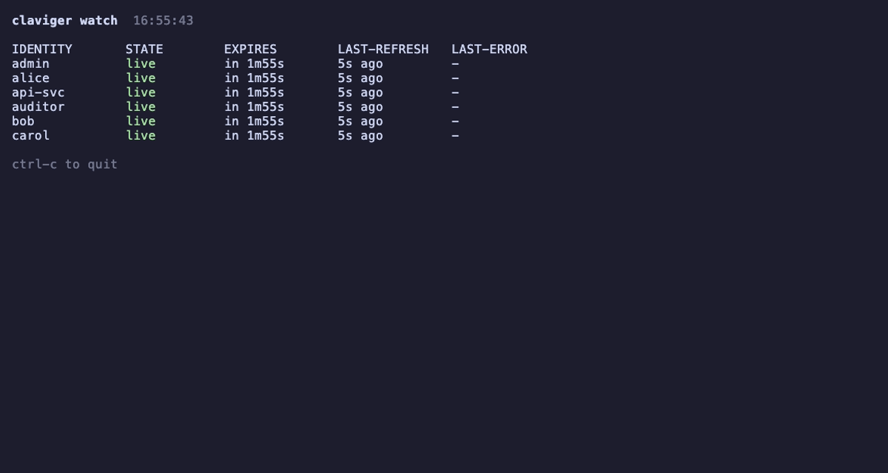

# Claviger

[](https://github.com/Su1ph3r/claviger/releases/latest)
[](go.mod)
[](LICENSE)
[](https://github.com/Su1ph3r/claviger/releases/latest)

A local session authority for penetration testers. Claviger owns the login
lifecycle for a set of test identities, keeps every one of them authenticated, and
presents current credentials to your whole toolbox so nothing falls out of auth
mid-run. The name is Latin for "key-bearer".



It solves two everyday problems:

- **Keep-alive.** Point a tool (curl, ffuf, sqlmap, nuclei, a script) at an
  identity's local gateway port. When the token expires, Claviger transparently
  re-authenticates and the tool never sees a 401.
- **Authz diffing.** `claviger replay` sends one request (or a whole corpus) under
  several identities at once and prints a status table, so broken authorization (a
  low-privilege identity that gets a 200, or a cross-tenant read) is visible at a
  glance.

See `docs/design.md` for the full design and the [wiki](https://github.com/Su1ph3r/claviger/wiki)
for guides.

## Install

**Homebrew** (macOS and Linux):

```
brew install su1ph3r/tap/claviger
```

**Download a release binary.** Grab the archive for your OS and architecture from
the [latest release](https://github.com/Su1ph3r/claviger/releases/latest), verify
it against `checksums.txt`, extract, and put `claviger` on your `PATH`. Debian and
RPM packages (`.deb`, `.rpm`) are attached for Linux.

**With Go.** Requires Go 1.22 or newer:

```
go install github.com/Su1ph3r/claviger@latest
```

**Build from source.**

```
make build          # builds ./claviger with the version stamped from git
./claviger version  # prints the built version
```

`make build` compiles a single static binary with the version baked in via
`-ldflags`. A plain `go build -o claviger .` also works (its version reports
`dev`). Multi-platform release archives are produced with goreleaser:

```
make snapshot   # local release artifacts, no tag or publish
make release    # tagged release; requires goreleaser and a git tag
```

## Configure

Create `claviger.yaml`. `target` is the base URL of the app under test. Each
identity declares a login recipe (`type`), the credentials to use, and a `logout`
signature describing how the target signals an expired session.

### Recipe types

Claviger ships four recipe types.

**`form`** submits a login form as a POST and captures the resulting session
cookie:

```yaml
target: https://app.example.com
identities:
  - name: user-a
    type: form
    login_url: https://app.example.com/login
    username: alice
    password: CHANGE_ME
    logout:
      status_codes: [401, 302]
      location_contains: /login
```

**`oauth`** runs an OAuth2 password grant and holds the access token:

```yaml
  - name: admin
    type: oauth
    token_url: https://app.example.com/oauth/token
    username: admin
    password: CHANGE_ME
    logout:
      status_codes: [401]
      body_contains: unauthenticated
```

**`multistep`** runs a scripted sequence of requests for logins that need a CSRF
fetch, a redirect hop, or a token pulled from an intermediate page. Each step can
`extract` a value (from the response `body`, a `header`, or a `json` key path) into
a named flow variable. Step URLs, form fields, and bodies may reference
`{{password}}` (seeded from the identity's resolved password) and any extracted
variable such as `{{csrf}}`. The `capture` block maps flow variables onto the
session: `csrf` is a template stored as the session's anti-CSRF value, and `bearer`
extracts the token from the last step's response.

```yaml
  - name: user-b
    type: multistep
    password: CHANGE_ME
    steps:
      - method: GET
        url: https://app.example.com/login
        extract:
          - name: csrf
            from: body
            pattern: 'name="csrf" value="([^"]+)"'
      - method: POST
        url: https://app.example.com/login
        form:
          username: bob
          password: "{{password}}"
          csrf: "{{csrf}}"
    capture:
      csrf: "{{csrf}}"
      bearer:
        name: token
        from: json
        pattern: access_token
    logout:
      status_codes: [401]
```

**`browser`** drives a real headless Chrome via CSS selectors, for SPA / SSO / MFA
logins that cannot be scripted with plain HTTP. Set the login URL, the field and
submit selectors, and exactly one success condition (`success_url_contains` or
`success_selector`). `headful: true` opens a visible window so an operator can
complete an interactive MFA prompt. `capture.bearer_localstorage` names a
`localStorage` key whose value becomes the session's bearer token.

```yaml
  - name: sso-user
    type: browser
    login_url: https://sso.example.com/login
    username: carol
    password: CHANGE_ME
    username_selector: "#username"
    password_selector: "#password"
    submit_selector: "button[type=submit]"
    success_url_contains: /dashboard
    headful: true
    capture:
      bearer_localstorage: access_token
    logout:
      status_codes: [401]
```

(The Chrome binary is auto-detected; set `CLAVIGER_CHROME` to override the path.)

### Secret sources

`password` holds the credential inline and expands `${ENV}` references against the
environment, so a secret can come from a variable instead of the file:

```yaml
    password: "${APP_PASSWORD}"
```

Two indirect sources avoid putting the secret in the file at all. Precedence is
`password`, then `password_file`, then `password_command`:

```yaml
    password_file: /run/secrets/app-password       # read the trimmed file contents
```

```yaml
    password_command: "pass show app/alice"         # run the command, use its stdout
```

`password_command` runs through `sh -c`, so keychain / `pass` / vault pipelines
work as written.

### TLS

A global `tls` block sets the trust and client-auth policy for reaching the target;
any identity can override it with its own `tls` block:

```yaml
tls:
  insecure: false                 # skip certificate verification (opt-in, unsafe)
  ca_cert: /path/to/ca.pem        # PEM CA bundle to trust
  client_cert: /path/to/client.pem
  client_key: /path/to/client-key.pem
identities:
  - name: user-a
    type: form
    # ...
    tls:
      insecure: true              # per-identity override of the global policy
```

The same settings are available as CLI flags on `daemon` and `replay`
(`--insecure`, `--ca-cert`, `--client-cert`, `--client-key`); the flags override
the config. Disabling verification prints a warning on stderr.

### CSRF injection

An optional per-identity `csrf` block makes the gateway fetch a fresh anti-CSRF
token before each state-changing request, extract it with `pattern`'s first capture
group, and set it on `header` for the listed `methods`:

```yaml
    csrf:
      fetch_url: https://app.example.com/csrf
      pattern: '"token":"([^"]+)"'
      header: X-CSRF-Token
      methods: [POST, PUT, PATCH, DELETE]
```

### Backoff

A global `backoff` block overrides the refresh rate-limit ceiling. A zero value
uses the store default (10 refreshes per 60s per identity):

```yaml
backoff:
  max_burst: 20
  window: 60s
```

The config file holds credentials: protect it with filesystem permissions and do
not commit it.

## Run the daemon

```
claviger daemon --config claviger.yaml
```

It prints one gateway URL per identity and the control socket path:

```
identity admin  -> http://127.0.0.1:8888
identity user-a -> http://127.0.0.1:8889
control socket: /run/user/1000/claviger/claviger.sock
```

Point a tool at an identity's URL (not `HTTP_PROXY`, this is a reverse proxy):

```
curl http://127.0.0.1:8889/api/whoami        # stays authenticated across token expiry
ffuf -u http://127.0.0.1:8889/FUZZ -w words   # the whole fleet stays logged in
```

### Daemon flags

- `--base-port` (default 8888): first gateway listener port; identities take
  consecutive ports.
- `--socket`: control socket path (default `$XDG_RUNTIME_DIR/claviger.sock` or
  `~/.claviger/claviger.sock`).
- `--gateway-token <secret>`: require an `X-Claviger-Token: <secret>` header on
  every gateway request, which closes the residual browser-CSRF path and gates
  other local users. Pass `--gateway-token auto` to generate and print a random
  token at startup. Off by default to keep CLI use transparent; when off, the
  daemon prints a startup warning that the gateway ports are unauthenticated.
- `--refresh-interval` (default 30s): how often to proactively refresh sessions
  near expiry; `0` disables the background loop.
- `--log-level` (default `info`): `error`, `warn`, `info`, or `debug`.
- `--audit-log <file>`: append one JSON record per gateway request (see Security
  notes).
- `--insecure`, `--ca-cert`, `--client-cert`, `--client-key`: the TLS flags above.

If any identity's login or token endpoint uses plaintext `http://`, the daemon
prints a startup warning that credentials would travel in cleartext (the scheme is
reported, never the endpoint).

## Using it with your tools

When the daemon starts it prints one loopback gateway port per identity:

```
identity admin  -> http://127.0.0.1:8888
identity user-a -> http://127.0.0.1:8889
```

Each port is a reverse proxy that injects that identity's live session and forwards
to the configured `target`. Point any HTTP tool at the port instead of the real
target, and the tool stays authenticated as that identity for the whole run. When
the token expires, Claviger re-authenticates and retries transparently, so the tool
never sees a 401. If you started the daemon with `--gateway-token`, add an
`X-Claviger-Token: <token>` header to each request.

**curl, ffuf, sqlmap, nuclei.** Use the gateway port as the base URL:

```
curl http://127.0.0.1:8889/api/records/42
ffuf -w paths.txt -u http://127.0.0.1:8889/FUZZ
sqlmap -u "http://127.0.0.1:8889/search?q=1" --batch
nuclei -u http://127.0.0.1:8889/
```

**Burp Suite.** Aim Repeater, Intruder, or the Scanner at an identity's gateway
port rather than the target: set the request line to `http://127.0.0.1:8889/...`
(or set the Repeater/Intruder target host to `127.0.0.1` and port to the identity's
port). Claviger keeps that identity logged in across a long Intruder run, so a
session that expires mid-run does not poison the results. With `--gateway-token`
set, add the header once under Proxy > Match and replace (or Repeater's request
editor): `X-Claviger-Token: <token>`. Because the gateway rejects cross-site
requests, drive it from Burp's own tooling rather than a browser pointed through
Burp's proxy.

**A tool that only takes a header.** For a script or tool that cannot use a proxy
port but accepts an `Authorization` header, print a live one:

```
claviger header user-a        # -> Authorization: Bearer <token>
```

Note this is a snapshot, not the auto-refreshed gateway: fetch it again after the
token would have expired, or prefer the gateway port for a long run.

## Authz diffing

### Single request

Send the same request as several identities and compare:

```
claviger replay --config claviger.yaml --as admin --as user-a --as anon --path /api/records/42
```

```
IDENTITY     STATUS SIZE     TIME
admin        200    412      1.2ms
user-a       403    21       0.9ms
anon         401    27       0.7ms
```

`anon` is a reserved name meaning "send no session". A row that returns an
unexpected 200 (for example `user-a` reading another user's record) is the finding.
`replay` exits non-zero only when every identity fails.

### Corpus replay

Replay a whole request set across the identities instead of one path:

```
claviger replay --config claviger.yaml --as admin --as user-a --corpus requests.txt
```

- `--corpus <file>`: the request set to replay. `--corpus` and `--path` are
  mutually exclusive, and `--method` cannot be combined with `--corpus` (methods
  come from the corpus).
- `--format requests|har|openapi`: the corpus format (auto-detected from the file
  extension when omitted).
- `--include-unsafe`: include state-changing methods (POST/PUT/PATCH/DELETE) from
  an OpenAPI corpus. By default an OpenAPI corpus contributes only safe methods;
  requests and HAR corpora replay every method they contain.

Output is a request-by-identity matrix. Each request line is marked `DIFFERS` when
the identities did not all return the same status:

```
GET /api/records/42  DIFFERS
  admin        200    412
  user-a       403    21
GET /api/public
  admin        200    88
  user-a       200    88
```

`DIFFERS` reports a **fact** (the statuses are not all equal), not a verdict.
Claviger does not judge whether a difference is a vulnerability; the operator does
the analysis.

HAR corpora have their captured identity headers (`Cookie`, `Authorization`,
`Proxy-Authorization`, `X-CSRF-Token`) stripped on load, so the corpus carries only
the request shape and each identity replays under its own injected session rather
than the session that captured the HAR.

## Other commands

```
claviger identities --config claviger.yaml         # list configured identities
claviger header user-a --config claviger.yaml      # print a live Authorization header
claviger status                                    # per-identity session health
```

Read a live session over the control socket (returns bearer token and cookies):

```
curl --unix-socket "$XDG_RUNTIME_DIR/claviger/claviger.sock" http://x/creds/user-a
```

## Security notes

- Gateway ports are loopback-only. Host + Origin + Sec-Fetch-Site checks block
  browser DNS-rebinding and modern cross-site requests. Use `--gateway-token` to
  fully close the residual (legacy-browser / other-local-user) path.
- The `X-Claviger-Token` gateway secret and the `X-Claviger-Identity` internal
  routing header are stripped before forwarding and never reach the upstream
  target. Hop-by-hop headers (`Connection`, `Proxy-Connection`, and any header the
  request's `Connection` lists) are stripped in both directions.
- The audit log records only identity, method, path, and status. It never records
  the query string (which can carry secrets), headers, cookies, tokens, or bodies.
- The control socket is created owner-only (0600) in a private per-user directory.
- Credentials are held in memory and, when inline, in the plaintext config; there
  is no keychain integration (use `password_command` to source from one).

### Not built

Claviger deliberately does not include:

- **Windows support.** Claviger targets Unix-like hosts (control socket, runtime
  dir, `sh -c` password commands).
- **A forward proxy (MITM interception).** The gateway is a per-identity reverse
  proxy; there is no `HTTP_PROXY`-style CONNECT/TLS-intercepting mode.
- **A verdict / judgement engine.** `replay` reports status facts and a `DIFFERS`
  marker; it does not decide whether a difference is a bypass. Burp's AuthMatrix and
  Autorize own that ground.
- **A browse-and-capture UI.** Claviger does not record traffic you browse through;
  that is Burp's proxy history.

## Test

```
go test ./... -race
```

An end-to-end harness drives the built binary against a self-signed HTTPS target
with real tooling (curl, ffuf, nuclei, sqlmap, headless Chrome, and corpus replay):

```
make e2e
```

## License

MIT. See [LICENSE](LICENSE).
